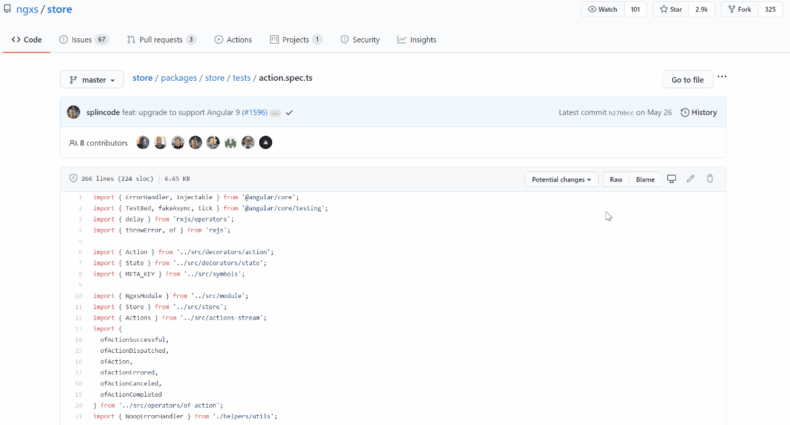

# Potential changes for GitHub

> **Warning**: This extension is still in a very early stage and it serves as a proof of concept. Please keep that in mind when you use it.

Browser extension that shows which pull requests contain changes related to a file.

* [Install in Chrome](https://chrome.google.com/webstore/detail/potential-changes-for-git/neehipoljbecacjcgcceflmlikiadkob)

### Demo 

Currently, the extension has the following limitations:
- It is limited to Public repositories only.
- It is limited to repositories with 10 or less pull requests.
- GitHub has a rate limit of 60 requests per hour. Usually same requests are cached but if you want to check multiple files in different repositories, you can quickly "run out" of requests.

Most of the limitations above are there just because I wanted to save time and focused on solving the core idea behind this extension.
